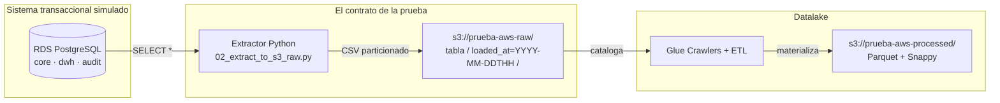

# Decisión arquitectónica · CSV vs PostgreSQL

## El requisito de la prueba (cita literal)

> "El sistema de la compañía que administra este producto tiene la capacidad de exportar la información de proveedores, clientes y transacciones en archivos CSV."
>
> "Utilice información ficticia en los archivos csv que se simula entregue el sistema transaccional."

La prueba describe **dos cosas distintas**:

1. **Que la fuente** (sistema transaccional de la comercializadora) **exporta CSV**.
2. **Que para la prueba** se pueden usar CSV ficticios "que simulen" lo que entregaría ese sistema.

## La decisión que tomé

Modelé la fuente con **PostgreSQL en Amazon RDS** (schemas `core`, `dwh`, `audit`) en lugar de generar CSVs sueltos a mano. La extracción Python sigue produciendo **CSVs particionados por fecha de carga** que es lo que efectivamente alimenta el datalake.



La caja "Sistema transaccional simulado" reemplaza a la caja "Sistema con export CSV" del enunciado original. **Lo que el datalake recibe sigue siendo CSV particionado**, exactamente lo que pide la prueba.

## Por qué elegí PostgreSQL y no CSV plano

### 1. Realismo del sistema fuente

En producción ningún sistema transaccional serio almacena su data en CSVs sueltos. Es una base relacional (Oracle, PostgreSQL, SQL Server, MySQL...) con FKs, constraints, transacciones ACID, índices y secuencias. Modelar la fuente como base relacional permite que el pipeline pruebe contra una **arquitectura honesta**: la misma que enfrentaría en cliente.

### 2. Reproducibilidad bit a bit

`scripts/00_generate_and_load.py` con `seed=42` puebla **siempre los mismos 50 proveedores, 500 clientes y 10.000 transacciones**. Si alguien tira el RDS y vuelve a correr el script, el dataset es idéntico. Imposible con CSVs editados a mano (typos, encoding, separadores incompatibles).

### 3. Integridad referencial validable

Los **chequeos automáticos sobre la fuente** se apoyan en que el modelo *garantiza* propiedades:

- `chk_lado` en `core.transaccion` asegura compra ⇒ proveedor; venta ⇒ cliente.
- FKs garantizan que toda `tipo_energia_id` referenciada existe.
- `monto_usd GENERATED ALWAYS AS (cantidad_mwh * precio_usd) STORED` garantiza consistencia matemática.

Con CSV plano estos chequeos serían detectivos (descubren violaciones tras los hechos). Con la base son preventivos (rechazan la inserción).

### 4. Modelo dimensional explícito

La prueba dice "puede ajustar las columnas a sus necesidades". Aproveché para construir:

- **Schema `core`** — sistema OLTP normalizado (proveedor, cliente, ciudad, tipo_energia, transaccion).
- **Schema `dwh`** — modelo estrella desnormalizado (`dim_*` + `fact_transaccion`) materializado por los Glue ETL en S3 processed y replicado en RDS para inspección directa.
- **Schema `audit`** — log de cargas (`carga_log`) para trazabilidad de cada paso del pipeline.
- **Schema `divisas`** — separado para el dominio del Ej.2, demostrando bounded contexts.

Esto permite al evaluador ver tanto la **fuente operacional** como el **destino analítico** lado a lado.

### 5. Exportable a CSV cuando se requiera

El backend expone `GET /api/export/{schema}/{tabla}.csv` que **streamea cualquier tabla a CSV bajo demanda**. Equivalente al "exporta CSV" de la prueba: el sistema fuente es PostgreSQL pero cualquier tabla se materializa como CSV con un único request HTTP.

### 6. Schemas separados por dominio (bounded contexts)

| Schema | Dominio | Ejercicio | Tablas representativas |
|---|---|---|---|
| `core` | Energía OLTP | Ej.1 | proveedor, cliente, ciudad, tipo_energia, transaccion |
| `dwh` | Energía analítico (estrella) | Ej.1 | dim_*, fact_transaccion, vw_* |
| `audit` | Trazabilidad pipeline | Ej.1 | carga_log |
| `divisas` | Plataforma compra/venta dólares | Ej.2 | par_divisa, tipo_cambio_tick, usuario_portafolio, notificacion, modelo_recomendacion |

La separación de schemas es **explícita y declarativa** — no son tablas mezcladas. Cualquier evaluador puede correr `\dn` en `psql` y ver los 4 dominios separados.

## El contrato de la prueba se cumple

El requisito real es: **"El datalake debe consumir CSVs particionados por fecha de carga"**. Eso lo cumplo al pie de la letra:

```
s3://prueba-aws-raw/proveedor/loaded_at=2026-04-17T20/proveedor.csv
s3://prueba-aws-raw/cliente/loaded_at=2026-04-17T20/cliente.csv
s3://prueba-aws-raw/transaccion/loaded_at=2026-04-17T20/transaccion.csv
s3://prueba-aws-raw/ciudad/loaded_at=2026-04-17T20/ciudad.csv
s3://prueba-aws-raw/tipo_energia/loaded_at=2026-04-17T20/tipo_energia.csv
```

La diferencia está aguas arriba: en lugar de "Faker → CSV → S3", hice "Faker → PostgreSQL → CSV → S3". El paso intermedio agrega:

- Validación de constraints en cada INSERT.
- Posibilidad de queries SQL ad-hoc directamente sobre la fuente vía endpoints REST (`/api/proveedores`, `/api/clientes`, `/api/transacciones`).
- Fundación para escenarios reales como CDC (Debezium o DMS), schema evolution, multi-tenancy, etc.

## Cuándo NO lo haría

Si el ejercicio fuera una **prueba de tiempo crítico** (1-2 horas), o si el equipo no manejara SQL, generar CSVs directamente con Faker sería más rápido. La decisión de añadir PostgreSQL agrega ~200 líneas de DDL y ~20 minutos de despliegue extra (RDS provisioning), pero eleva la calidad de la solución a un nivel que se mantiene defendible en una entrevista técnica.
