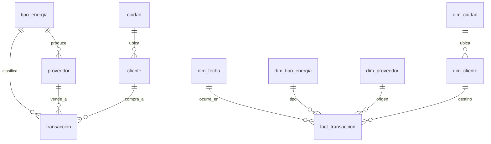

# Modelo de datos · esquema estrella

> El RDS combina dos schemas:
> - **`core`** — tablas tipo OLTP normalizadas que simulan el sistema transaccional fuente.
> - **`dwh`** — modelo dimensional desnormalizado (estrella) materializado tras los ETLs.
>
> Esta separación permite mostrar tanto el origen *operacional* como el destino *analítico* — exactamente como ocurriría en una arquitectura real.

## Diagrama ER (Mermaid)

## Diccionario · schema `core`

| Tabla | Cardinalidad esperada | Comentario |
|---|---|---|
| `tipo_energia` | 5 | Catálogo: eólica, hidroeléctrica, solar, biomasa, nuclear (con `factor_co2_kg_mwh` real) |
| `ciudad` | ~25 | Capitales y ciudades intermedias de Colombia + algunas LatAm con coordenadas |
| `proveedor` | 50 | FK a `tipo_energia`; `capacidad_mw` realista por tipo |
| `cliente` | 500 | FK a `ciudad`; `segmento ENUM(residencial,comercial,industrial)` |
| `transaccion` | ~10.000 | Hecho transaccional con `CHECK` que asegura: compra → proveedor; venta → cliente; **monto_usd GENERATED** |

## Diccionario · schema `dwh` (estrella)

| Tabla | Tipo | Comentario |
|---|---|---|
| `dim_fecha` | dimensión | Calendario 2024-2026, con `es_finde`, `es_feriado`, `trimestre`, `nombre_mes` |
| `dim_tipo_energia` | dimensión | Subset (read-only) de `core.tipo_energia` |
| `dim_ciudad` | dimensión | Subset de `core.ciudad` |
| `dim_proveedor` | dimensión SCD-1 | Cargada por `transform_dimensions.py` |
| `dim_cliente` | dimensión SCD-1 | Cargada por `transform_dimensions.py` |
| `fact_transaccion` | hecho | Particionado en S3 por `anio, mes`; FKs a las 5 dims |

## Vistas analíticas (`dwh.vw_*`)

- `vw_resumen_mensual` — `(anio, mes, tipo_energia, tipo_transaccion) → (num_tx, mwh, monto_usd, precio_promedio)`
- `vw_top_clientes` — clientes ordenados por MWh comprado
- `vw_margen_energia` — diferencia precio venta − precio compra promedio por tipo
- `vw_kpis` — agregación rápida usada por `/api/kpis`
