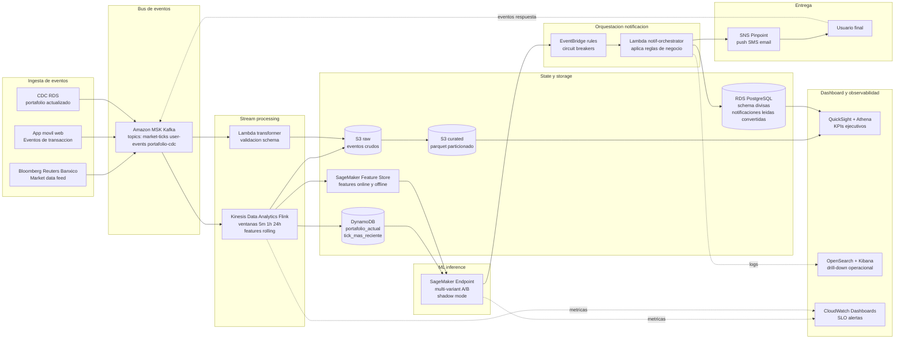
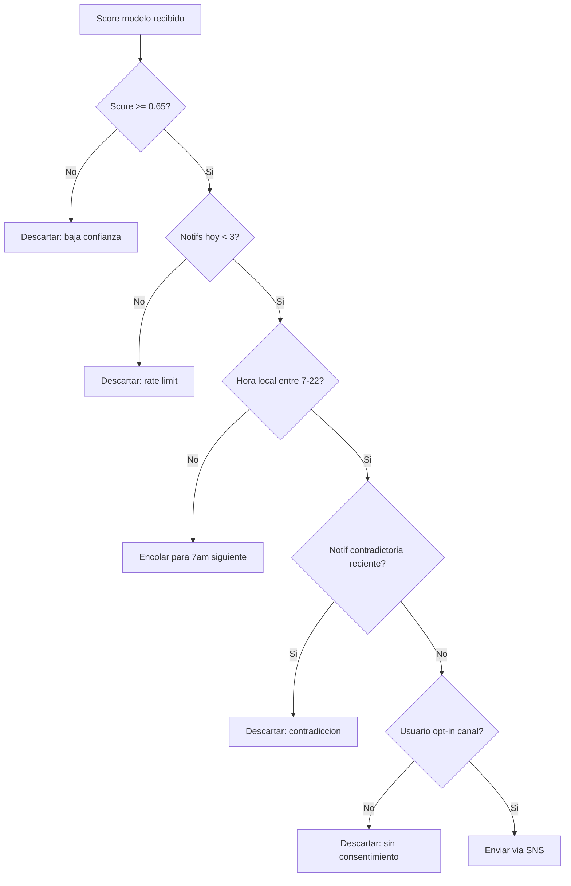

# Ejercicio 2 · Arquitectura · Plataforma de notificaciones de divisas

## Contexto

Una startup opera una plataforma en tiempo real de compra y venta de dólares. Quiere construir un sistema de **recomendación de transacciones personalizadas** que envíe notificaciones a cada usuario sugiriendo el momento óptimo para comprar o vender USD basándose en:

1. Patrones históricos de transacción del usuario (frecuencia, ticket promedio, sensibilidad a precio).
2. Condiciones de mercado en tiempo real (precio spot, volatilidad reciente, spread bid-ask).
3. Estado actual del portafolio del usuario (saldo COP vs USD, perfil de riesgo declarado).

## Supuestos del diseño

| Supuesto | Valor | Justificación |
|---|---|---|
| Volumen tickets de mercado | 4-8 ticks/segundo por par | Bloomberg/Reuters publican entre 1 y 10 cada 250-500ms en horario activo. |
| Volumen transacciones usuario | ~10K/día base, picos 50K/día en eventos macro | Startup en LatAm escalando agresivamente. |
| Latencia objetivo notificación | p99 < 5s desde tick → push entregado | Permite al usuario reaccionar antes que el spread se ajuste. |
| Modelo ML | Clasificador binario `comprar/vender/observar` con score 0-1 | Simple y auditable; permite shadow mode + A/B trivial. |
| Compliance | Consentimiento explícito (GDPR + ley colombiana 1581/2012) por canal | Push, SMS, email opt-in/opt-out independiente. |
| Reglas de negocio | Máximo 3 notificaciones/día por usuario, no entre 22:00 y 07:00 | Evita fatiga y respeta hábito. |

## Arquitectura propuesta



## Componentes clave

| Componente | Rol | Por qué lo elegí | Alternativas evaluadas |
|---|---|---|---|
| Amazon MSK (Kafka) | Bus de eventos durable con replay | Throughput sostenido, replay para reentrenar modelos, integración nativa con Flink | Kinesis Data Streams (más caro a este volumen) · SQS (sin replay) |
| Kinesis Data Analytics (Flink) | Stream processing con state | Ventanas deslizantes con checkpointing, soporta SQL y Java | Spark Streaming (peor latencia) · Lambda (sin state cross-event) |
| DynamoDB | Estado del portafolio + último precio por par | Lectura ms por user_id, on-demand auto-scale | RDS (no aguanta concurrencia ms a esta escala) |
| S3 raw + curated | Datalake histórico para reentrenos y BI | Costo storage bajísimo, queryable con Athena | Redshift directamente (caro para crudo) |
| RDS PostgreSQL `divisas.*` | Persistencia transaccional de notificaciones, portafolios, modelos | ACID, queries para dashboard ejecutivo, reuso del cluster RDS del Ej.1 | DynamoDB (queries ad-hoc difíciles) |
| SageMaker Feature Store | Sincroniza features entre training e inference | Evita training-serving skew, garantiza consistencia online/offline | Feast self-hosted (más overhead operacional) |
| SageMaker Endpoint multi-variante | Inferencia online con A/B y shadow mode | Permite traffic shifting gradual sin downtime | Endpoint Lambda con modelo embebido (límite tamaño + cold start) |
| EventBridge + Lambda orquestador | Aplica reglas de negocio antes de enviar | Reglas declarativas + escalable + barato | Step Functions (overhead innecesario para 1 paso) |
| SNS + Pinpoint | Entrega multi-canal (push, SMS, email) | Tracking de entrega, segmentación, costo bajo | SES + Twilio externos (más integraciones) |
| OpenSearch + Kibana | Drill-down operacional | Búsquedas full-text en logs, dashboards en tiempo real | Datadog (caro a escala) |
| QuickSight + Athena | KPIs ejecutivos | Pago por usuario+sesión, conecta a S3 directo | Looker (licencia cara) |

## Flujo de datos · paso a paso

1. **Tick de mercado** llega del feed externo y se publica al topic `market-ticks` en MSK.
2. **Flink en KDA** lee el tick, calcula features rolling (volatilidad 5min, retorno 1h, distancia al EMA 200).
3. **Features se materializan** en tres lugares: copia online en DynamoDB (`tipo_cambio:{par}`), copia offline en S3 raw (Parquet horario) y Feature Store.
4. **Trigger de evaluación**: cada N ticks (configurable, default 5) o cada vez que un usuario actualiza su portafolio (CDC) se dispara evaluación de oportunidad.
5. **SageMaker Endpoint** recibe el feature vector (mercado + portafolio + perfil usuario) y devuelve `{tipo: comprar/vender/observar, score: 0..1}`.
6. **EventBridge** aplica reglas de circuit breaker:
   - Si score < 0.65, descartar (no notificar dudas).
   - Si usuario ya recibió 3 notificaciones hoy, descartar.
   - Si hora local fuera de 07:00-22:00, encolar para mañana.
   - Si ya hay notificación contradictoria reciente (<30 min), suprimir.
7. **Lambda orquestador** que sobrevive las reglas:
   - Inserta `divisas.notificacion` en RDS con score, par, precio referencia.
   - Publica a SNS topic correspondiente al canal preferido del usuario.
8. **SNS/Pinpoint** entrega push (FCM/APNs), SMS o email según preferencia.
9. **Usuario interactúa** (lee/click/convierte) y la app emite eventos `notification-clicked`, `transaction-from-notification` que se publican a MSK.
10. **Loop de feedback**: estos eventos alimentan el reentrenamiento semanal del modelo (sample positivo si hubo conversión, negativo si no) y actualizan métricas (CTR, conversión).

## Modelo de ML

**Algoritmo de producción**: LightGBM + temporal fusion (versión `v0.3-prod` registrada en `divisas.modelo_recomendacion`).

**Features online** (latencia < 50ms):

- Mercado: `spread_bps`, `volatilidad_5m`, `retorno_1h`, `distancia_ema200`, `volumen_relativo`
- Portafolio: `usd_pct_total`, `cop_pct_total`, `desviacion_perfil_objetivo`
- Usuario: `frecuencia_tx_30d`, `ticket_promedio_30d`, `sensibilidad_precio_score`
- Mercado macro: `vix_proxy`, `tasa_interes_diferencial`

**Features offline** (reentrenamiento):

- Histórico 90 días de comportamiento del usuario.
- Outcome de notificaciones previas (clicked, converted, ignored).

**Validación**: holdout temporal último 14 días, métricas tracked: AUC, Precision@K, recall, **CTR uplift vs control** (la métrica de negocio).

**MLOps**:

- CI/CD del modelo con SageMaker Pipelines.
- Shadow mode 7 días antes de prod (modelo nuevo recibe 100% del tráfico inferencia pero las decisiones se descartan; se compara contra modelo activo).
- A/B 14 días con 10% del tráfico.
- Auto-rollback si CTR_uplift cae > 15% durante 24h consecutivas.

## Dashboard de datos

Tres capas de visualización para audiencias distintas:

### Operacional · OpenSearch + Kibana

Para ingenieros on-call. Refresh segundo a segundo.

| Métrica | Umbral SLO | Alarma |
|---|---|---|
| Throughput ticks ingeridos / seg | > 4 | Pager si < 2 durante 60s |
| Latencia inferencia p50 / p99 | < 50ms / < 250ms | Pager si p99 > 500ms |
| Throughput notificaciones / min | depende de hora | — |
| Cola backlog Kafka (lag) | < 1000 mensajes | Pager si > 5000 |
| Tasa error Lambda orchestrator | < 0.1% | Pager si > 1% |

### Producto · QuickSight + Athena

Para PMs y growth. Refresh diario.

| Métrica | Tracking |
|---|---|
| CTR notificaciones por canal | Push, SMS, email · meta CTR > 18% global |
| Tasa conversión post-notif | Notif clicked → transacción ejecutada · meta > 6% |
| Volumen recomendaciones · tipo | comprar / vender / observar (distribución) |
| P&L portafolios usuarios | Variación 7d / 30d post adopción |
| Distribución score modelo | Histograma + percentiles (detección drift) |
| Modelo vs control (A/B) | CTR uplift, conversion uplift, retention 7d |

### Ejecutivo · QuickSight con embed en panel admin

Para founders e inversionistas. Refresh diario.

- Usuarios activos diarios/semanales/mensuales (DAU/WAU/MAU).
- Ingreso atribuible a recomendaciones (volumen transaccionado x spread capturado).
- NPS post-notificación (encuesta in-app trimestral).
- Costo unitario por notificación enviada (AWS bill / # notifs).
- Health del modelo (versión activa, fecha último entrenamiento, métricas vs SLO).

## Reglas de negocio (circuit breakers)



## Métricas de éxito (KPIs)

- CTR notificación > 18% global, > 25% en push (canal premium).
- Conversión post-clic > 6% (transacción ejecutada en < 30 min).
- Latencia p99 evento → notificación entregada < 7s.
- Drift del modelo: AUC en producción no cae > 5% vs entrenamiento durante 30 días.
- Costo unitario < $0.005 por notificación entregada.

## Compliance

- **Consentimiento explícito** por canal, registrado en `divisas.usuario_portafolio.preferencias_notif` (JSONB).
- **Retención**: ticks de mercado en S3 con lifecycle a Glacier a los 90 días, eliminación a los 5 años. Notificaciones individuales por 2 años (PII).
- **DLP**: Macie escaneando S3 raw para detectar PII no esperada.
- **Auditoría**: CloudTrail data events sobre buckets sensibles + tabla `audit.acceso_notif` con cada lectura.
- **Derecho al olvido**: endpoint `DELETE /api/usuario/{id}/datos` que dispara batch de borrado en RDS + S3 (Iceberg permite borrado puntual sin reescribir partición completa).

## Costos estimados a 100K usuarios/día activos

| Servicio | Mes (USD) | Notas |
|---|---|---|
| MSK (3 brokers `kafka.t3.small`) | $135 | Suficiente para 1M eventos/día |
| KDA Flink (4 KPU) | $440 | Procesamiento continuo |
| DynamoDB (on-demand) | $80 | ~50M reads + 5M writes/día |
| S3 (raw + curated, ~100GB/día) | $70 | Con lifecycle a Glacier |
| Lambda (orchestrator + validators) | $20 | ~5M invocaciones/día |
| SageMaker Endpoint (`ml.c5.large` x 2) | $190 | 24x7 con auto-scale |
| SageMaker Feature Store | $50 | 200 features online |
| SNS + Pinpoint | $130 | ~300K notifs/día (push + SMS + email) |
| RDS PostgreSQL (`db.r6g.large`) | $185 | Compartido con `divisas.*` |
| EventBridge + CloudWatch | $30 | Reglas + dashboards |
| QuickSight (5 autores + 50 readers) | $290 | Pago por usuario |
| OpenSearch (2 nodos `t3.small.search`) | $90 | Logs operacionales |
| **Total estimado** | **~$1,710/mes** | |
| Costo por usuario activo | **$0.017/usuario/mes** | |

## Schema en RDS · `divisas`

Ya implementado en este RDS (separado intencionalmente del Ej.1):

```sql
divisas.par_divisa             -- 3 pares: USD/COP, USD/MXN, EUR/USD
divisas.tipo_cambio_tick       -- 90.000 ticks de los últimos 30 días
divisas.usuario_portafolio     -- 100 portafolios (sample de core.cliente)
divisas.notificacion           -- 500 notificaciones generadas con score
divisas.modelo_recomendacion   -- 3 versiones (v0.1, v0.2, v0.3-prod activo)
divisas.vw_dashboard           -- vista de KPIs para el dashboard
```

El backend expone este schema vía los endpoints `/api/divisas/dashboard`, `/api/divisas/ticks`, `/api/divisas/notificaciones`, `/api/divisas/modelos` con datos materializados desde PostgreSQL.

## Pendientes para implementación productiva

- Definir contrato de eventos formal con Avro Schema Registry (Confluent Schema Registry sobre MSK).
- Implementar el modelo ML real (actualmente solo registro su catálogo).
- Configurar Pinpoint con campañas y journeys.
- Setup propio de canary deployments (versión `v0.4` en shadow continuo).
- DR plan (replicación cross-region MSK + S3 + RDS read replica).
