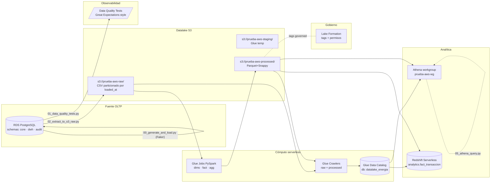

# Pipeline · Datalake Energía

> **Resumen.** RDS PostgreSQL (modelo dimensional) → extracción Python → S3 raw (CSV) → Glue Crawler (catálogo) → Glue ETL (3 jobs PySpark) → S3 processed (Parquet+Snappy particionado) → Athena (consultado desde Python y desde el backend) → Redshift Serverless (datawarehouse).

## Diagrama (Mermaid)

## Capas (capacidad → propósito)

| Capa | Bucket / Tabla | Formato | Particionamiento | Quién la escribe |
|---|---|---|---|---|
| **Source OLTP** | RDS PostgreSQL `core.*` | Filas | índices por FK | scripts Python (Faker) |
| **Raw** | `s3://prueba-aws-raw/<tabla>/` | CSV | `loaded_at=YYYY-MM-DDTHH/` | `02_extract_to_s3_raw.py` |
| **Staging** | `s3://prueba-aws-staging/glue-temp/` | mixto | n/a | Glue (temporal) |
| **Processed** | `s3://prueba-aws-processed/{dims,fact,agg_*}/` | Parquet+Snappy | `anio/mes` (fact); SCD-1 (dims) | Glue Jobs PySpark |
| **Catalog** | Glue DB `datalake_energia` | metadatos | n/a | Glue Crawlers |
| **Analytical · Athena** | `athena://datalake_energia.*` | SQL en S3 | hereda processed | usuarios/backend |
| **Analytical · Redshift** | `analytics.fact_transaccion` | columnar | (auto Redshift) | `06_load_to_redshift.py` |

## 3 transformaciones Glue (lo que la prueba pide)

1. **`transform_dimensions`** — lee CSVs de raw para dims (proveedor, cliente, ciudad, tipo_energia), aplica **SCD-1** (último loaded_at gana) y materializa a Parquet por dim.
2. **`transform_fact`** — lee `core.transaccion`, deriva `fecha_id = YYYYMMDD`, recalcula `monto_usd = cantidad_mwh × precio_usd`, particiona por `(anio, mes)`.
3. **`transform_aggregates`** — agrega métricas mensuales por `(anio, mes, tipo_energia, tipo_transaccion)` y materializa en `agg_resumen_mensual/` para que Athena/Redshift respondan sin escanear el fact completo.

## Periodicidad

- Crawler raw: **horario** (cron `0 * * * ? *`).
- ETL jobs: **on-demand** vía `04_run_glue_etl.py` o programable con Glue Workflow.
- Cargas a Redshift: bajo demanda — el workgroup pausa solo tras inactividad (cost saver).

## Ventana de datos

- 24 meses: `2024-01-01` → `2026-04-30`.
- Estacionalidad sinusoidal modelada en `00_generate_and_load.py` (`estacionalidad(d)`): picos Q1 (caliente) y Q3 (frío relativo).
- Volúmenes: 50 proveedores, 500 clientes, ~10.000 transacciones (mix 55% compras / 45% ventas).
